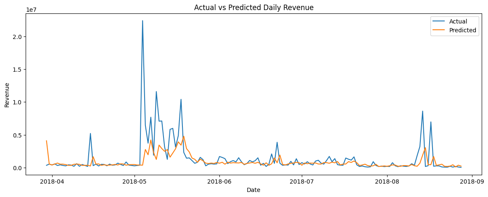
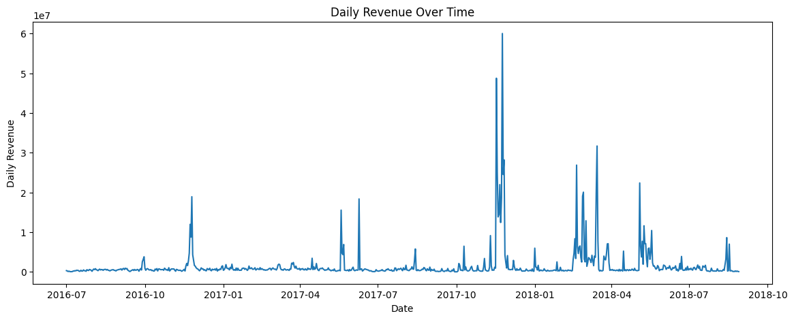
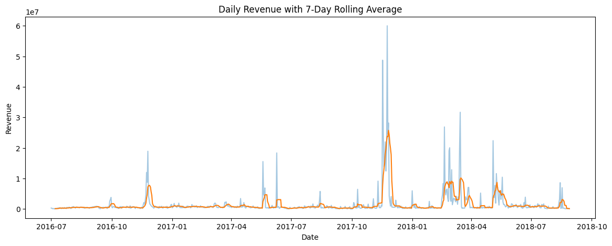
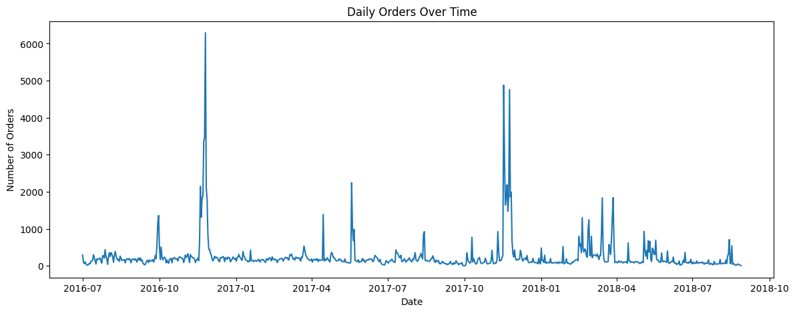
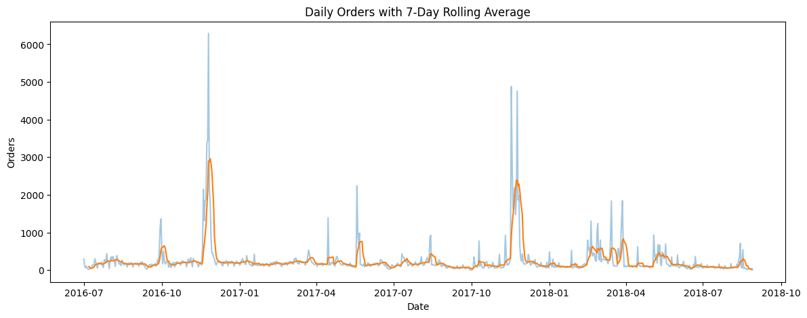

# Pakistan Retail Revenue Forecasting System

An end-to-end data science and machine learning project for forecasting daily realized revenue from historical Pakistani e-commerce sales data.

## Live Demo

🚀 **[Open the Live Streamlit Dashboard](https://pakistan-retail-revenue-forecasting-86uwkq6xstkz6exag5mvii.streamlit.app/)**

## Project Overview

This project transforms raw transaction-level e-commerce data into a daily revenue forecasting system.

The workflow includes:

- data cleaning and validation
- missing-value handling
- order-status filtering
- prevention of revenue double-counting
- daily sales aggregation
- time-series exploratory analysis
- lag and rolling-window feature engineering
- chronological train/test splitting
- baseline comparison
- machine learning model evaluation
- Streamlit dashboard development

## Dataset

The project uses the **Pakistan Largest Ecommerce Dataset**.

The raw data contains transaction-level information such as:

- order status
- order date
- SKU
- product price
- quantity ordered
- order grand total
- product category
- discount amount
- payment method
- customer information

The raw CSV is kept unchanged locally and is excluded from GitHub through `.gitignore`.

## Data Cleaning

The main cleaning steps were:

- removed completely empty rows
- removed empty export columns
- standardized column names
- dropped redundant fields
- converted order dates to datetime
- handled missing values
- filtered successful order statuses
- converted item-level records to unique orders before summing revenue
- removed zero and negative realized-revenue orders
- aggregated successful orders into daily revenue and order counts

The statuses treated as successful realized sales were:

- `complete`
- `received`
- `paid`
- `closed`

A key issue discovered during cleaning was that `grand_total` was repeated on every product row belonging to the same order. Revenue was therefore calculated only after reducing the data to one row per unique `increment_id`.

## Time-Series Feature Engineering

The final forecasting dataset contains calendar, lag, rolling, and volatility features.

The final model uses:

- day of week
- month
- day of month
- week of year
- weekend flag
- revenue lag 1
- revenue lag 2
- revenue lag 3
- revenue lag 7
- revenue lag 14
- revenue lag 30
- 3-day rolling revenue
- 7-day rolling revenue
- 14-day rolling revenue
- 30-day rolling revenue
- 7-day revenue standard deviation

Lagged and rolling features use only prior observations to avoid data leakage.

## Model Development

The data was split chronologically rather than randomly so the model was evaluated on future observations.

The following approaches were tested:

- previous-day revenue baseline
- 7-day seasonal baseline
- Random Forest Regressor
- Histogram Gradient Boosting
- log-transformed Random Forest

The strongest model was a **Random Forest Regressor trained on log-transformed daily revenue**.

## Final Model Performance

Performance on the held-out chronological test period:

| Metric | Result |
|---|---:|
| MAE | PKR 920,095 |
| RMSE | PKR 2,456,754 |
| SMAPE | 54.3% |

The previous-day baseline produced an MAE of approximately **PKR 1.19 million**, so the final model reduced MAE by roughly **23%**.

## Key Findings

Recent revenue history was substantially more useful than simple calendar features.

The most influential features included:

- `revenue_lag_1`
- `revenue_lag_7`
- short-term rolling revenue averages
- recent revenue volatility

The largest forecasting errors occurred around unusually large revenue spikes.

Simple holiday and event flags produced negligible improvement, suggesting that major spikes were likely driven by unavailable factors such as:

- promotions
- advertising campaigns
- flash sales
- inventory changes
- retailer-specific events

## Visualizations

### Actual vs Predicted Revenue



### Daily Revenue Over Time



### Daily Revenue with 7-Day Rolling Average



### Daily Orders Over Time



### Daily Orders with 7-Day Rolling Average



## Streamlit Dashboard

The Streamlit app provides:

- next-day revenue forecast
- latest daily revenue
- 7-day average revenue
- 30-day average revenue
- historical revenue visualization
- recent revenue trend
- model performance metrics
- actual vs predicted revenue chart
- recent sales table

Run the app locally with:

```bash
streamlit run app.py
```

## Project Structure

```text
e-commerce_project/
├── app.py
├── README.md
├── requirements.txt
├── .gitignore
├── data/
│   ├── processed/
│   │   └── daily_sales.csv
│   └── raw/
│       └── Pakistan Largest Ecommerce Dataset.csv
├── models/
│   └── revenue_forecast_model.pkl
├── notebooks/
│   ├── data_cleaning.ipynb
│   └── model_evaluation.ipynb
└── screenshots/
    ├── actual_vs_predicted.png
    ├── daily_orders.png
    ├── daily_orders_rolling.png
    ├── daily_revenue.png
    └── daily_revenue_rolling.png
```

## Tech Stack

- Python
- Pandas
- NumPy
- Scikit-learn
- Matplotlib
- Joblib
- Streamlit
- Jupyter Notebook
- Git
- GitHub

## Limitations

The model does not have access to detailed promotional and operational data, which limits its ability to forecast sudden extreme spikes in revenue.

Other limitations include:

- only about two years of historical data
- no advertising-spend data
- no inventory data
- no detailed campaign data
- no external economic variables
- no category-level forecasting in the first version

## Future Improvements

Potential improvements include:

- category-level demand forecasting
- promotion and campaign features
- comparison with XGBoost or LightGBM
- time-series cross-validation
- prediction intervals
- additional external economic features
- richer event and campaign data
- model monitoring and retraining workflow

## Repository

**GitHub:** https://github.com/massabibrahim13/pakistan-retail-revenue-forecasting
